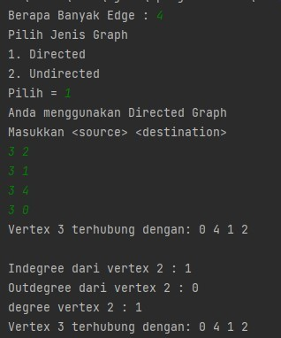
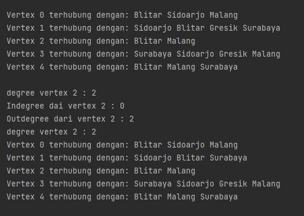

# Laporan Praktikum Jobsheet 12 Pertemuan 15
### Nama  : Yofandra Arta Priyoga
### NIM   : 2141720121
### Kelas : TI-1G
### Absen : 29

## Jawaban Pertanyaan
<p> <br>

### Output percobaan 2.1


### Jawaban Subbab 2.1
1.  - Pencarian Melebar  (Breadth First Search atau BFS) Untuk Mencari 
    - Pencarian Mendalam (Depth First Search atau DFS) Untuk Mencari 
    - Algoritma Bellman-Ford Untuk mencari lintasan terpendek 
    - Algoritma Boruvska Untuk menentukan pohon penjangkau minimum 
2. Untuk memanggil objek Linkedlist dan mengubahnya menjadi objek array yang mana nantinya akan di isi oleh vertex 
3. Alasannya adalah untuk dapat mengenalkan data dari depan 
4. Dengan cara looping edge, jika vertex lebih besar dari I dan destination sama dengan I maka edge akan otomatis di hapus 
5. Output tidak error tapi data vertex yang di keluarkan mengalami perubahan path / lintasan 

### Output percobaan 2.2


### Jawaban Subbab 2.2
1. Directed gaph degree mempunyai nilai yang berbeda karena terdapat in out 
Sedangkan undirected degree mempunyai nilai yang sama karena tidak terdapat in out 
2. Karena pada matriks index di mulai dari 0, agar vertex dalam matrix bernilai sama dengan vertex yang seharusnya maka harus di tambah +1 
3. Untuk menampilkan apakah vertex tersedia atau tidak 
4. Jenis directed graph 
5. Agar program yang error dapat tetap berjalan dan tidak terhenti TUGAS 1 

### Tugas Praktikum 
1. Class graph
```java
import java.util.Scanner;

public class Graph {
    int vertex;
    DoubleLinkedLists list[];

    public Graph(int vertex) {
        this.vertex = vertex;
        list = new DoubleLinkedLists[vertex];
        for (int i = 0; i < vertex; i++) {
            list[i] = new DoubleLinkedLists();
        }
    }

    public void addEdge(int source, int destination) {
        list[source].addFirst(destination);
        list[destination].addFirst(source);
    }

    public void degree(int source) throws Exception {
        System.out.println("degree vertex " + source + " : " + list[source].size());

        int k, totalIn = 0, totalOut = 0;
        for (int i = 0; i < vertex; i++) {
            for (int j = 0; j < list[i].size(); j++) {
                if (list[i].get(j) == source)
                    ++totalIn;
            }
            for (k = 0; k < list[source].size(); k++) {
                list[source].get(k);
            }
            totalOut = k;
        }
        System.out.println("Indegree dari vertex " + source + " : " + totalIn);
        System.out.println("Outdegree dari vertex " + source + " : " + totalOut);
        System.out.println("degree dari vertex " + source + " : " + (totalIn + totalOut));
    }

    public void removeEdge(int source, int destination) throws Exception {
        for (int i = 0; i < vertex; i++) {
            if (i == destination) {
                list[source].remove(destination);
            }
        }
    }

    public void removeAllEdges() {
        for (int i = 0; i < vertex; i++) {
            list[i].clear();
        }
        System.out.println("Graph berhasil dikosongkan");
    }

    public void printGraph() throws Exception {
        for (int i = 0; i < vertex; i++) {
            if (list[i].size() > 0) {
                System.out.print("Vertex " + i + " terhubung dengan: ");
                for (int j = 0; j < list[i].size(); j++) {
                    System.out.print(list[i].get(j) + " ");
                }
                System.out.println("");
            }
        }
        System.out.println(" ");
    }

    public static void main(String[] args) throws Exception {
        Scanner sc = new Scanner(System.in); 
        int vertextotal,x,y; 
        System.out.print("Masukkan berapa banyak vertex : "); 
        vertextotal = sc.nextInt(); 
        Graph graph = new Graph(vertextotal); 
        System.out.println("Masukkan <source> <destination>"); 
        int i = 0; 
        while (i <= vertextotal){ 
             x = sc.nextInt(); 
            y = sc.nextInt(); 
  
            graph.addEdge(x,y); 
            i++; 
        } 
        x = sc.nextInt(); 
        y = sc.nextInt(); 
        graph.addEdge(x,y); 
  
        graph.printGraph(); 
        graph.degree(2); 
        graph.removeEdge(1,2); 
        graph.printGraph(); 
    }
}
```

Output


2. Class Graph
```java
import java.util.Scanner;

public class Graph {
    int vertex;
    boolean pilih;
    DoubleLinkedLists list[];

    public Graph(int vertex, boolean pilih) {
        this.vertex = vertex;
        this.pilih = pilih;
        list = new DoubleLinkedLists[vertex];
        for (int i = 0; i < vertex; i++) {
            list[i] = new DoubleLinkedLists();
        }
    }

    public void addEdge(int source, int destination) { 
        if (graphtype(pilih)) { 
            list[source].addFirst(destination); 
        } else { 
            //add edge 
            list[source].addFirst(destination); 
            //add back adge (for undirected) 
            list[destination].addFirst(source); 
        } 
  
    } 

    public void degree(int source) throws Exception { 
        if (graphtype(pilih)) { 
            //degree directed graph 
            //inDegree 
            int k, totalIn = 0, totalOut = 0; 
            for (int i = 0; i < vertex; i++) { 
                for (int j = 0; j < list[i].size(); j++) { 

                    if (list[i].get(j) == source) { 
                        ++totalIn; 
                    } 
                } 
                //outDegree 
                for (k = 0; k < list[source].size(); k++) { 
                    list[source].get(k); 
                } 
                totalOut = k; 
            } 
            System.out.println("Indegree dari vertex " + source + " : " + totalIn); 
            System.out.println("Outdegree dari vertex " + source + " : " + totalOut); 
            System.out.println("degree vertex " + source + " : " + (totalIn + totalOut)); 
        } else { 
            //degree undirected graph 
            System.out.println("degree vertex " + source + " : " + list[source].size()); 
        } 
    } 


    public void removeEdge(int source, int destination) throws Exception { 
        for (int i = 0; i < vertex; i++) { 
            if (i == destination) { 
                list[source].remove(destination); 
            } 
        } 
    } 

    public void removeAllEdges() {
        for (int i = 0; i < vertex; i++) {
            list[i].clear();
        }
        System.out.println("Graph berhasil dikosongkan");
    }

    public void printGraph() throws Exception {
        for (int i = 0; i < vertex; i++) {
            if (list[i].size() > 0) {
                System.out.print("Vertex " + i + " terhubung dengan: ");
                for (int j = 0; j < list[i].size(); j++) {
                    System.out.print(list[i].get(j) + " ");
                }
                System.out.println("");
            }
        }
        System.out.println(" ");
    }

    boolean graphtype(boolean pilih) { 
        return pilih; 
    } 

        public static void main(String[] args) throws Exception { 
        int pilih; boolean info; 
        Scanner sc = new Scanner(System.in); 
        System.out.println("Pilih Jenis Graph"); 
        System.out.println("1. Directed"); 
        System.out.println("2. Undirected"); 
        System.out.print("Pilih = "); 
        pilih = sc.nextInt(); 
        if (pilih == 1) { 
            System.out.println("Anda menggunakan Directed Graph"); 
            info = true; 
        } else { 
            System.out.println("Anda menggunakan UnDirected Graph"); 
            info = false; 
        } 
        Graph graph = new Graph(6, info); 
        graph.addEdge(0, 1); 
        graph.addEdge(0, 4); 
        graph.addEdge(1, 2); 
        graph.addEdge(1, 3); 
        graph.addEdge(1, 4); 
        graph.addEdge(2, 3); 
        graph.addEdge(3, 4); 
        graph.addEdge(3, 0); 
        graph.printGraph(); 
        graph.degree(2); 
        graph.removeEdge(1, 2); 
        graph.printGraph(); 
    } 
} 
```

Output
   

3. Class graph
```java
import java.util.Scanner;

public class Graph { 
    //menambahkan atribut 
    int vertex; 
    boolean pilih; 
    LinkedList[] list; 
  
    //menambahkan konstruktor default untuk inisialisasi variabel vertex 
    public Graph(int vertex, boolean pilih) { 
        this.vertex = vertex; 
        this.pilih = pilih; 
        list = new LinkedList[vertex]; 
        //menambahkan perulangan untuk jumlah vertex 
        for (int i = 0; i < vertex; i++) { 
            list[i] = new LinkedList(); 
        } 
    } 
  
    //method addEdge() 
    public void addEdge(int source, int destination) { 
        if (graphtype(pilih)) { 
            list[source].addFirst(destination); 
        } else { 
            //add edge 
            list[source].addFirst(destination); 
            //add back adge (for undirected) 
            list[destination].addFirst(source); 
        } 
  
    } 
  
    //method degree() untuk menampilkan jumlah derajat lintasan pada suatu vertex 
    public void degree(int source) throws Exception { 
        if (graphtype(pilih)) { 
            //degree directed graph 
            //inDegree 
            int k, totalIn = 0, totalOut = 0; 
            for (int i = 0; i < vertex; i++) { 
                for (int j = 0; j < list[i].size(); j++) { 
                    if (list[i].get(j) == source) { 

                        ++totalIn; 
                    } 
                } 
                //outDegree 
                for (k = 0; k < list[source].size(); k++) { 
                    list[source].get(k); 
                } 
                totalOut = k; 
            } 
            System.out.println("Indegree dari vertex " + source + " : " + totalIn); 
            System.out.println("Outdegree dari vertex " + source + " : " + totalOut); 
            System.out.println("degree vertex " + source + " : " + (totalIn + totalOut)); 
        } else { 
            //degree undirected graph 
            System.out.println("degree vertex " + source + " : " + list[source].size()); 
        } 
    } 
  
    //method removeEdge() untuk menghapus lintasan suatu graph 
    public void removeEdge(int source, int destination) throws Exception{ 
        for (int i = 0; i < list[source].size(); i++) { 
            if (destination==list[source].get(i)){ 
                list[source].remove(i); 
            } 
        } 
    } 
  
    //method removeAllEdges() untuk menghapus semua vertex yang ada di dalam graph 
    public void removeAllEdges() { 
        for (int i = 0; i < vertex; i++) { 
            list[i].clear(); 
        } 
        System.out.println("Graph berhasil dikosongkan"); 
    } 
  
    //method printGraph() untuk mencatak graph ter-update 
    public void printGraph() throws Exception { 
        for (int i = 0; i < vertex; i++) { 
            if (list[i].size() > 0) { 
                System.out.print("Vertex " + i + " terhubung dengan: "); 
                for (int j = 0; j < list[i].size(); j++) { 
                    System.out.print(list[i].get(j) + " "); 
                } 
                System.out.println(); 
            } 
        } 
        System.out.println(" "); 
    } 
  
    boolean graphtype(boolean pilih) { 
        return pilih; 
    } 

        public static void main(String[] args) throws Exception { 
            int x,y,pilih; boolean info; 
            Scanner sc = new Scanner(System.in); 
            System.out.print("Berapa Banyak Edge : "); 
            int edge = sc.nextInt(); 
            System.out.println("Pilih Jenis Graph"); 
            System.out.println("1. Directed"); 
            System.out.println("2. Undirected"); 
            System.out.print("Pilih = "); 
            pilih = sc.nextInt(); 
            if (pilih == 1) { 
                System.out.println("Anda menggunakan Directed Graph"); 
                info = true; 
            } else { 
                System.out.println("Anda menggunakan UnDirected Graph"); 
                info = false; 
            } 
            Graph graph = new Graph(edge, info); 
            System.out.println("Masukkan <source> <destination>"); 
            int i = 0; 
            while (i < edge){ 
                x = sc.nextInt(); 
                y = sc.nextInt(); 
      
                graph.addEdge(x,y); 
                i++; 
            } 
      
            graph.printGraph(); 
            graph.degree(2); 
            graph.removeEdge(1, 2); 
            graph.printGraph(); 
        } 
    
}    
```

Output


4. Class graph
```java
public class Graph { 
    //menambahkan atribut 
    int vertex; 
    LinkedList[] list; 
  
    //menambahkan konstruktor default untuk inisialisasi variabel vertex 
    public Graph(int vertex) { 
        this.vertex = vertex; 
        list = new LinkedList[vertex]; 
        //menambahkan perulangan untuk jumlah vertex 
        for (int i = 0; i < vertex; i++) { 
            list[i] = new LinkedList(); 
        } 
    } 
  
    //method addEdge() 
    public void addEdge(int index, int index2, String source, String destination) { 
        //add edge 
        list[index].addFirst(destination); 
  
        //add back adge (for undirected) 
        list[index2].addFirst(source); 
    } 
  
    //method degree() untuk menampilkan jumlah derajat lintasan pada suatu vertex 
    public void degree(int source) throws Exception { 
        //degree undirected graph 
        System.out.println("degree vertex " + source + " : " + list[source].size()); 
  
        //degree directed graph 
        //inDegree 
        int k, totalIn = 0, totalOut = 0; 
        for (int i = 0; i < vertex; i++) { 
            for (int j = 0; j < list[i].size(); j++) { 
                list[i].get(j); 
            } 
            //outDegree 
            for (k = 0; k < list[source].size(); k++) { 
                list[source].get(k); 
            } 
            totalOut = k; 
        } 
        System.out.println("Indegree dai vertex " + source + " : " + totalIn); 
        System.out.println("Outdegree dari vertex " + source + " : " + totalOut); 
        System.out.println("degree vertex " + source + " : " + (totalIn + totalOut)); 
    } 
  
    //method removeEdge() untuk menghapus lintasan suatu graph 
    public void removeEdge(int source, int destination) throws Exception { 
        for (int i = 0; i < vertex; i++) { 
            if (i == destination) { 
                list[source].remove(destination); 
            } 
        } 
    } 
  
    //method printGraph() untuk mencatak graph ter-update 
    public void printGraph() throws Exception { 
        for (int i = 0; i < vertex; i++) { 
            if (list[i].size() > 0) { 
                System.out.print("Vertex " + i + " terhubung dengan: "); 
                for (int j = 0; j < list[i].size(); j++) { 
                    System.out.print(list[i].get(j) + " "); 
                } 
                System.out.println(); 
            } 
        } 
        System.out.println(" "); 
    } 
 
    public static void main(String[] args) throws Exception { 
        Graph graph = new Graph(6); 
//      0 Surabaya 
//      1 Malang 
//      2 Gresik 
//      3 Blitar 
//      4 Sidoarjo 
        graph.addEdge(0, 1, "Surabaya", "Malang"); 
        graph.addEdge(0, 4, "Surabaya", "Sidoarjo"); 
        graph.addEdge(1, 2, "Malang", "Gresik"); 
        graph.addEdge(1, 3, "Malang", "Blitar"); 
        graph.addEdge(1, 4, "Malang", "Sidoarjo"); 
        graph.addEdge(2, 3, "Gresik", "Blitar"); 
        graph.addEdge(3, 4, "Blitar", "Sidoarjo"); 
        graph.addEdge(3, 0, "Blitar", "Surabaya"); 
        System.out.println(); 
        graph.printGraph(); 
        graph.degree(2); 
        graph.removeEdge(1, 2); 
        graph.printGraph(); 
    }
} 
```

Output
